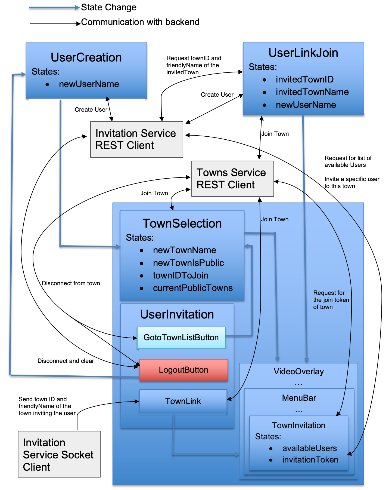

# Design of Covey.Town project

## Backend

We modified the backend of Covey.Town so that it supports users and invitations

### Introduction

We added services related to user, invitation and tried to keep all the original designs. Now the join town pipeline becomes:

1. create username => select a town to join / create a town => entering town

2. use a invitaiton link => create username => entering town

Therefore, we added classes and REST api to support:

- create a user
- retrieve town information by invitationID that embedded in invitation link

In order to do invitation system, we added classes, REST api and listner to support:

- retrieve all in-system user (who created a username)
- Invite a user to a given town
- retrieve a town's invitationID
- one listener for each user that subscribes to invitation

### CRC cards

<table>
      <tr>
         <td colspan='2'><b>Class Name: ActiveUser</b></td>
      </tr>
      <tr>
        <td colspan='2'><b>States:</b>
            <ul>
                <li><b>id:</b> the unique identifier of the user</li>
                <li><b>username:</b> the username of the user</li>
                <li><b>token:</b> the token used to subscribe token</li>
            </ul>
        </td>
      </tr>
      <tr>
        <td><b>Responsibilities</b></td>
        <td><b>Collaborators</b></td>
      </tr>
      <tr>
        <td rowspan='1'>Representing a active user in the system</td>
        <td>CoveyUserController</td>
      </tr>
</table>

<table>
      <tr>
         <td colspan='2'><b>Class Name: (interface) CoveyInvitationListener</b></td>
      </tr>
      <tr>
        <td colspan='2'><b>States:</b>
            <ul>
                <li><b>id:</b> the id of this listner's owner</li>
            </ul>
        </td>
      </tr>
      <tr>
        <td><b>Responsibilities</b></td>
        <td><b>Collaborators</b></td>
      </tr>
      <tr>
        <td rowspan='2'>An listener that subscribed to invitation events. Once receieved invitation, it will notify the socket's owner the invitaiton information (coveyTownID and FriendlyName). Also it subscribes to disconnect event.</td>
        <td>CoveyUserController</td>
      </tr>
      <tr>
        <td>Socket</td>
      </tr>
</table>

<table>
      <tr>
         <td colspan='2'><b>Class Name: CoveyTownController (changed)</b></td>
      </tr>
      <tr>
        <td colspan='2'><b>Added States:</b>
            <ul>
                <li><b>invitationID:</b> the generated id for invitation (outside user)</li>
            </ul>
        </td>
      </tr>
      <tr>
        <td><b>Responsibilities</b></td>
        <td><b>Collaborators (with InvitationID)</b></td>
      </tr>
      <tr>
        <td rowspan='2'>Except for the original use, we added an invitationID to this class. User haven't launched the app may use the invitationID to identify which town the user is trying to join.</td>
        <td>CoveyTownsStore</td>
      </tr>
      <tr>
        <td>UserInvitationRequestHandlers</td>
      </tr>
</table>

<table>
      <tr>
         <td colspan='2'><b>Class Name: CoveyTownsStore (changed)</b></td>
      </tr>
      <tr>
        <td colspan='2'><b>No added states</b>
        </td>
      </tr>
      <tr>
        <td><b>Responsibilities</b></td>
        <td><b>Collaborators (with InvitationID)</b></td>
      </tr>
      <tr>
        <td rowspan='2'>Except for the original use, we added a method to find townController by InvitationID</td>
        <td>CoveyTownController</td>
      </tr>
      <tr>
        <td>UserInvitationRequestHandlers</td>
      </tr>
</table>

<table>
      <tr>
         <td colspan='2'><b>Class Name: CoveyUserController</b></td>
      </tr>
      <tr>
        <td colspan='2'><b>States:</b>
            <ul>
                <li><b>instance</b></li>
                <li><b>users:</b> The active users in the system</li>
                <li><b>listeners:</b> The invitation listeners subscribes the invitations</li>
            </ul>
        </td>
      </tr>
      <tr>
        <td><b>Responsibilities</b></td>
        <td><b>Collaborators</b></td>
      </tr>
      <tr>
        <td rowspan='4'>This class stores all existing user in the system (who have created a username). This class is managing the users, including list all users, find a specific user, create a user, delete a user. Also, CoveyUserController stores the in system invitations listeners. It sends the invitations to the given user.</td>
        <td>ActiveUser</td>
      </tr>
      <tr>
        <td>UserInvitationRequestHandlers</td>
      </tr>
      <tr>
        <td>CoveyInvitationListener</td>
      </tr>
      <tr>
        <td>Socket</td>
      </tr>
</table>

<table>
      <tr>
         <td colspan='2'><b>Class Name: UserInvitatoinRequestHandlers</b></td>
      </tr>
      <tr>
        <td colspan='2'><b>States:</b>
            <ul>
                <li><b>CoveyUserController:</b> the controller stores the user and handles invitations</li>
                <li><b>CoveyTownsStore:</b> stores all the towns</li>
            </ul>
        </td>
      </tr>
      <tr>
        <td><b>Responsibilities</b></td>
        <td><b>Collaborators</b></td>
      </tr>
      <tr>
        <td rowspan='5'>This class exports functions that handles the requests related to users and invitaitons. Including following: create a user, subscribe the new user's socket to listen to listners, list users, show the invitationID of a town, retrieve town information by invitationID, invite a existing user to a specific town</td>
        <td>CoveyTownController</td>
      </tr>
      <tr>
        <td>CoveyTownsStore</td>
      </tr>
      <tr>
        <td>CoveyUserController</td>
      </tr>
      <tr>
        <td>Socket</td>
      </tr>
      <tr>
        <td>Associating response/request interfaces</td>
      </tr>
</table>

## Frontend

We modified the frontend of Covey.Town so that it supports users and invitations.

We added services related to user, invitation and tried to keep all the original designs. We have designed to have a separated socket (user socekt) to deal with invitation activities (i.e. receive invitation from other other users) with the backend, aside from the original one dealing with town activities (town socket). Therefore, two sockets are created to capture different paths, where the town socket capturing `/town`, and the user socket capturing `/user`. The user socket is created after getting a valid response of creating a user from backend and is set to listening for `'invitedToTown'` from backend.

Here's a graph showing the achitecture of frontend components related to our project.

### React Components

#### UserCreation

This page has a text input box with some welcoming messages to let user to type in a username and a "Create" button. After hitting the "Create" button, the frontend will request the Invitation REST service to create a user and direct user to the TownSelection page.

#### UserInvitation

This components is a menu bar at the top of the page consisting of a "To Town List" button, a "Log out" button, and a drop down list, the component "TownLink", lists all the names and IDs of towns that sent invitations to this user with a button to join the coresponding town and a button to delete the invitation. The "To Town List" button would diconnect user from the town the user is in, and would be disabled if user is already in TownSelection page. The "Logout button" would disconnect user from backend totally, clear all states back to default and direct to the UserCreation page.

#### TownLink

This components is a drop down list consisiting of all the names and IDs of towns that sent invitations to this user with a button to join the coresponding town and a button to delete the invitation. This component would be refreshed when backend send invitation messages to frontend through websocket with path `/user`.

#### GoToTownListButton

This component is a button that would exit current town by disconnecting from the websocket with path `/town` and back to the TownSelection page upon clicking. This component would be disabled when `IVideoContext.room` is not connected since user would then either have already been on the TownSelection page or have not entered a username.

#### LogoutButton

This component is a button that would diconnect all connections, clear all states back to default, and back to the UserCreation page upon clicking. This component should be disabled exactly when `IVideoContext.room` is trying to, but have not yet, connect to twilio.

#### UserLinkJoin

This page has similar layout and functionalities with the UserCreation, but it has a invitation token passed from the props that relates to a specific town, which was extracted from the address. Before first rendering, this component would request the Town REST service for the `townID` and `friendlyName` of the related town. After typing in a valid user name in the text input box and click the "Create" button, this component would firstly send a request to Invitation REST service to create a user and then immediately request Town REST service to join the town.

#### TownInvitation

This component is placed as a button besides the TownSettings button at the bottom of the page in a town. Before first rendering, this component would request the Town REST service for the token of joining the current town. Upon clicking, it would pop up a window showing the invitation URL and a "Copy" button that would copy the invitation URL to user's clipboard. The window would also have a list of all available users requested from the backend, each entry consisting of their name, userID, and a "Invite" button that would send a request to backend to invite the corresponding user. This list would be refreshed every 2 seconds.

### Reducer related

##### Func: loginController

Set up a socket capturing `/user` and listening for `'invitedToTown'` from backend and update CoveyAppStates according to arguments. This function has similar functionality with GameController and should also be used similarly but with different arguments.

### Service related

#### ServiceClient

Construct a Service API client. Specify a serviceURL for testing, or otherwise defaults to the URL at the environmental variable REACT_APP_ROOMS_SERVICE_URL. Deal with all communications to the backend through REST API. This class was originally "TownsServiceClient".
